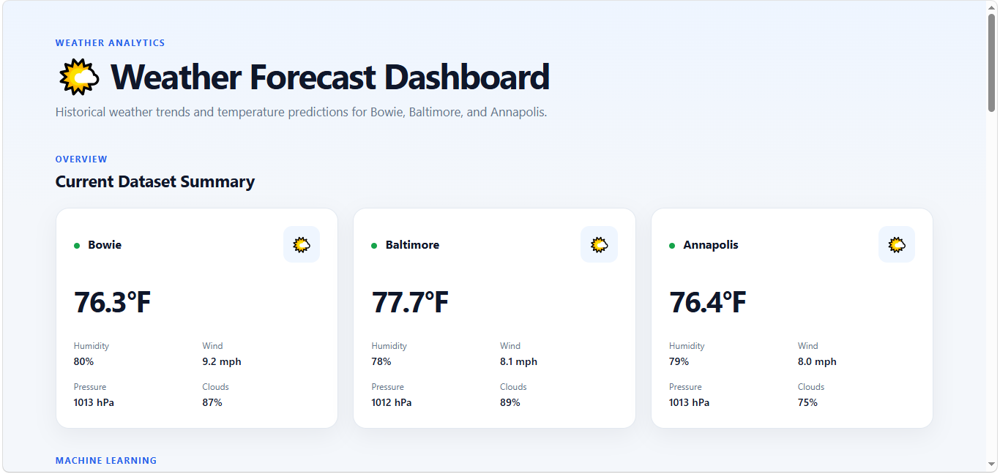
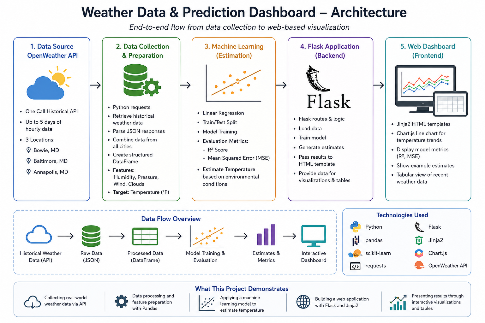

# Weather Data & Prediction Dashboard

A Flask-based data application that retrieves historical weather observations from the OpenWeather API, analyzes environmental conditions across multiple Maryland cities, trains a machine learning model, and presents temperature trends and predictions through an interactive web dashboard.



## Project Overview

This project was developed to explore how real-world weather data can be collected, analyzed, modeled, and presented through a web application.

The application retrieves historical weather observations for Bowie, Baltimore, and Annapolis, Maryland, including temperature, humidity, atmospheric pressure, wind speed, and cloud coverage.

The collected data is processed with Pandas and used to train a Linear Regression model that estimates temperature from observed weather conditions. Model performance, weather trends, predictions, and recent observations are then displayed through a Flask dashboard.

## System Architecture

The application integrates external weather data, Python-based processing and machine learning, and a Flask web interface. The diagram below shows the end-to-end flow from API collection through model evaluation and dashboard visualization.



## Skills Demonstrated

* Python application development
* REST API integration
* Data collection and transformation with Pandas
* Machine learning with scikit-learn
* Regression model evaluation
* Flask web application development
* Jinja2 template rendering
* Interactive visualization with Chart.js
* HTML and CSS
* Working with real-world environmental data

## Technologies

**Programming & Data**

* Python
* Pandas
* scikit-learn
* Requests

**Web Application**

* Flask
* HTML
* CSS
* Jinja2

**Visualization**

* Chart.js

**Data Source**

* OpenWeather API

## Weather Features

The application collects the following variables:

| Feature     | Description                                |
| ----------- | ------------------------------------------ |
| City        | Location associated with the observation   |
| Date/Time   | Timestamp of the weather observation       |
| Temperature | Observed temperature in degrees Fahrenheit |
| Humidity    | Relative humidity percentage               |
| Pressure    | Atmospheric pressure in hPa                |
| Wind        | Wind speed                                 |
| Clouds      | Percentage of cloud coverage               |

## Machine Learning

A Linear Regression model was used to examine the relationship between weather conditions and temperature.

### Features

* Humidity
* Atmospheric pressure
* Wind speed
* Cloud coverage

### Target

* Temperature

The dataset was divided into training and testing samples, and model performance was evaluated using:

* **R² Score**
* **Mean Squared Error (MSE)**

This component demonstrates the integration of a machine learning workflow into a web-based data application.

## Dashboard

The Flask dashboard provides several views of the collected and modeled data:

* Temperature trends for Bowie, Baltimore, and Annapolis
* Model R² and Mean Squared Error
* Example temperature estimates
* Recent weather observations
* Interactive time-series visualization

## Project Structure

```text
weather-prediction-dashboard/
├── app.py
├── templates/
│   └── index.html
├── static/
│   └── style.css
├── images/
│   └── dashboard.png
├── requirements.txt
├── .gitignore
└── README.md
```

## Project Context

This project was developed as an academic project focused on combining weather data, machine learning, and web application development.

Rather than focusing solely on model development, the project demonstrates an end-to-end workflow in which external data is collected, processed, analyzed, modeled, and presented through an interactive application.

## Key Takeaway

The project demonstrates how Python-based data science components can be integrated into a web application to transform external API data into an interactive analytical experience.
